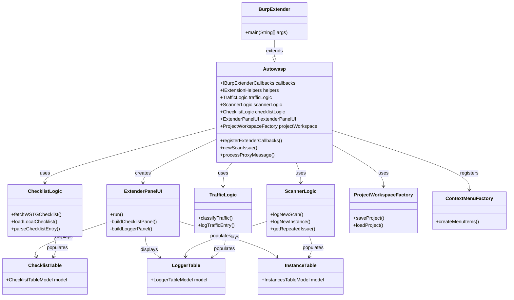
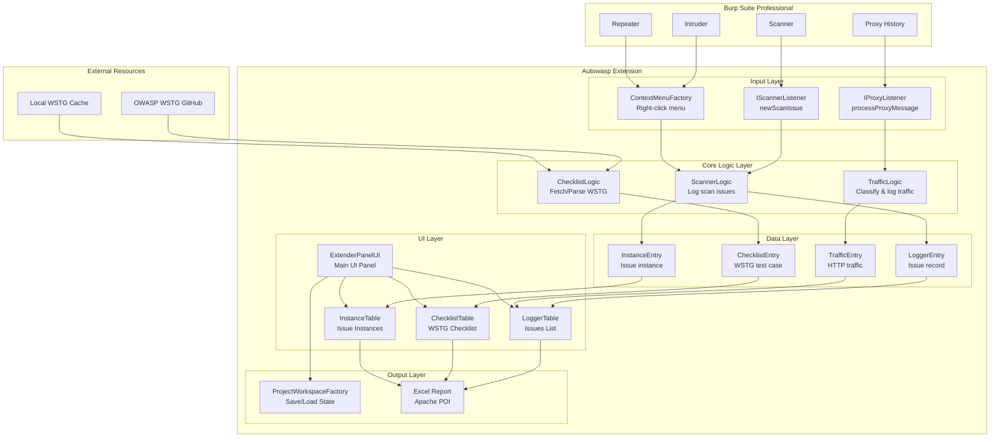

# Autowasp Burp Extension Architecture

This document describes the architecture and design of Autowasp, a Burp Suite extension that integrates issue logging with the OWASP Web Security Testing Guide (WSTG).

## Overview

Autowasp is an extension for Burp Suite Professional that provides:

- **Testing Checklist**: OWASP WSTG guide for penetration testing
- **Logger Tool**: Consolidation and logging of Burp Scanner issues
- **Report Generation**: Generate Excel reports from security findings


---

## Main Class/Package Diagram

The following diagram shows the main class structure and relationships between components:



---

## Data Flow Diagram

This diagram shows how data flows from Burp Suite through the Autowasp extension:



---

## Architecture Components

### 1. Entry Point

- **BurpExtender**: Main class that extends Autowasp and serves as the entry point for the Burp extension

### 2. Core Class (Autowasp)

Implements Burp Suite interfaces:

- `IBurpExtenderCallbacks`: Callbacks to Burp Suite
- `IExtensionHelpers`: Helper utilities
- `IScannerListener`: Listener for scanner events
- `IProxyListener`: Listener for proxy events

### 3. Logic Layer

| Component          | Description                                                      |
| ------------------ | ---------------------------------------------------------------- |
| **ChecklistLogic** | Fetch and parse OWASP WSTG checklist from GitHub or local cache  |
| **ScannerLogic**   | Manage logging and grouping of scan issues                       |
| **TrafficLogic**   | Classify and log HTTP traffic                                    |

### 4. Data Layer

| Model              | Description                           |
| ------------------ | ------------------------------------- |
| **LoggerEntry**    | Representation of discovered issues   |
| **InstanceEntry**  | Specific instance of an issue         |
| **ChecklistEntry** | Test case from WSTG                   |
| **TrafficEntry**   | HTTP traffic record                   |

### 5. UI Layer

| Component           | Description                           |
| ------------------- | ------------------------------------- |
| **ExtenderPanelUI** | Main panel displayed in Burp tab      |
| **ChecklistTable**  | Table displaying WSTG checklist       |
| **LoggerTable**     | Table displaying discovered issues    |
| **InstanceTable**   | Table displaying instances per issue  |

### 6. Output Layer

- **ProjectWorkspaceFactory**: Save/load project state
- **Excel Report**: Generate reports using Apache POI

---

## Feature and Workflow Diagrams

### Testing Checklist - OWASP WSTG


**Fetch Checklist from OWASP GitHub:**


**Load Local Checklist:**


---

### Logger Tool


**Traffic Logging:**


**Scanner Logic:**


---

### Usage Workflow

**1. Add Target Scope:**


**2. Send from Proxy/Intruder/Repeater:**


**3. Map to Checklist:**


**4. Write Comments:**


**5. Generate Report:**


---

## Dependencies

| Library                    | Version | Purpose                   |
| -------------------------- | ------- | ------------------------- |
| Apache Commons Collections | 4.3     | Collection utilities      |
| Apache Commons Compress    | 1.18    | Compression support       |
| GSON                       | 2.8.5   | JSON parsing              |
| Jsoup                      | 1.12.1  | HTML parsing (fetch WSTG) |
| Apache POI                 | 4.1.0   | Excel report generation   |
| XMLBeans                   | 3.1.0   | XML support for POI       |
| Burp Extender APIs         | 1.7.13  | Burp Suite integration    |

---

## Source Code Structure

```shell
src/main/java/
├── burp/
│   └── BurpExtender.java          # Entry point
├── autowasp/
│   ├── Autowasp.java              # Core class
│   ├── logic/
│   │   ├── ChecklistLogic.java    # WSTG checklist handling
│   │   ├── ScannerLogic.java      # Scanner issue handling
│   │   └── TrafficLogic.java      # Traffic classification
│   ├── model/
│   │   ├── LoggerEntry.java       # Issue model
│   │   ├── InstanceEntry.java     # Instance model
│   │   ├── ChecklistEntry.java    # Checklist item model
│   │   └── TrafficEntry.java      # Traffic model
│   ├── ui/
│   │   ├── ExtenderPanelUI.java   # Main UI
│   │   ├── ChecklistTable.java    # Checklist display
│   │   ├── LoggerTable.java       # Logger display
│   │   └── InstanceTable.java     # Instance display
│   ├── context/
│   │   └── ContextMenuFactory.java # Right-click menu
│   └── workspace/
│       └── ProjectWorkspaceFactory.java # Save/load state
```

---

## References

- [OWASP Web Security Testing Guide (WSTG)](https://owasp.org/www-project-web-security-testing-guide/)
- [Burp Extender APIs](https://portswigger.net/burp/extender/api/burp/package-summary.html)
- [Repository GitHub Autowasp](https://github.com/govtech-csg/Autowasp)
