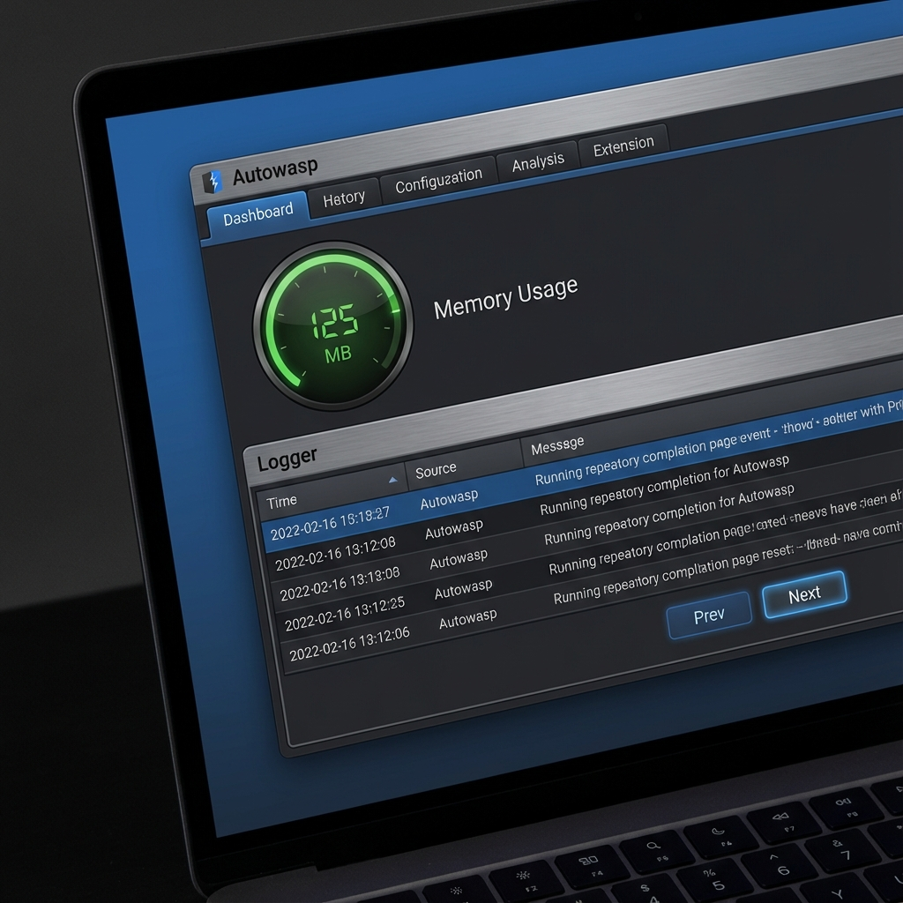

# Autowasp

[](https://opensource.org/licenses/Apache-2.0)


Welcome to Autowasp, a Burp Suite extension that integrates OWASP Web Security Testing Guide (WSTG) directly into your testing workflow. It provides a structured environment for penetration testers to track progress, log traffic, and generate comprehensive reports aligned with industry standards.

## Existing Features

Currently, Autowasp supports the following functionalities:

### 1. Testing Checklist - Be guided by OWASP

With the ability to fetch the OWASP WSTG checklist, Autowasp aims to aid new penetration testers in conducting penetration testing or web application security research. The testing checklist tab will extract useful information such as:

- Summary of OWASP WSTG test cases
- How to test – black/white box testing
- Relevant testing tools to aid your test


### 2. Logger Tool - Log down the Vulns

Autowasp Logger tab gives penetration testers the ability to extract and consolidate Burp Scanner issues. This extender tool will automate and flag vulnerable network traffic issues, allowing users to send vulnerable proxy items from Burp’s `proxy`, `intruder`, and `repeater` tab to the extender. These vulnerable issues can then be mapped to WSTG IDs and be used to generate an Excel report upon engaging in a penetration test.


### 3. Memory & Performance - Handle Large Scales

Autowasp is optimized for performance and stability during long-term engagements. Key improvements include:

- **Pagination:** Smoothly navigate through thousands of log entries without UI lag.
- **Data Limits:** Automatic cleanup and hard limits on list growth to prevent memory exhaustion.
- **Memory Monitor:** Real-time visibility into the extension's memory usage with visual warnings.



## Prerequisites

- Burp Suite Professional or Community (2024.1 or later)
- Java 21 or later

## Dependencies

- **Montoya API 2025.12** (Burp Suite Extension API)
- **Apache Commons Collections 4.5.0-M3**
- **Apache Commons Compress 1.28.0**
- **GSON 2.13.2**
- **Jsoup 1.21.2**
- **Apache POI 5.5.1** (Excel Report Generation)

## Installation

### 1. Using Pre-compiled JAR (Recommended)

1. Download the latest release build [from Releases](https://github.com/govtech-csg/Autowasp/releases).
2. Open Burp Suite.
3. Go to **Extensions** tab -> **Installed** -> **Add**.
4. Select **Java** as extension type, click **Select file** and select the `autowasp-2.1.0-jar-with-dependencies.jar` file.
5. You should see no output or errors and a new tab labelled **Autowasp** on the top row.

### 2. Building from Source

For advanced users who want to build the project manually (e.g. using Gradle, Docker, or Nix), please refer to the [Development Guide](docs/DEVELOPMENT.md) for detailed instructions.

## Usage

**A general testing workflow using Autowasp would include the following steps:**

1. Display the OWASP checklist in Autowasp for reference.
2. Add the target URL to **Scope**. The scope function will extract related results from Burp Scanner and listen for insecure web request and responses.
3. Map the scan issues to specific test cases in the checklist. OR
4. Manually explore the website's pages, then click **Enable Burp Scanner Logging** to display the scanner issues under the **Logger** tab.
5. Map findings to the checklist.
6. Insert security observations and evidence associated with the logs.
7. Generate a report containing the checklist, logs, evidence, and comments.

### 1. Displaying the Testing checklist

#### First time

1. Click the **Fetch WSTG Checklist** button to fetch the checklist from the [WSTG documentation](https://github.com/GovTech-CSG/wstg/blob/master/document/4-Web_Application_Security_Testing/README.md). (Note: this may take a few minutes due to the number of pages)
2. If you are working in an offline environment, click **Load local checklist** to start your penetration testing work. Do note that local checklist may not be updated frequently.


#### Subsequent times

1. Choose **Load local checklist** to start your penetration testing work.
2. This should load the checklist almost instantly.


#### Excluding Checklist item(s)

- If you find test cases that do not apply to your test, you can exclude these items by selecting the checkbox on the right.

### 2. Adding to scope and scanning

1. Add the target URL to scope and perform scan.


1. Manually explore the website's pages, then click **Enable Burp Scanner Logging** to display the scanner issues under the **Logger** tab.


1. Note that items from **Proxy -> HTTP History**, **Intruder** & **Repeater** tabs can be sent to Autowasp by right-clicking on them, followed by clicking **Send to Autowasp**.


### 3. Mapping findings to the checklist

- Click on a specific log in the **Logger** table.
- Click on the empty **Mapped to OWASP WSTG** field on the right side of the table entry.
- Choose a specific test to map the log to using the drop-down list.
- Note that this will only work if you have the checklist already displayed.


### 4. Insert security observations and evidence associated with the logs

1. Click on a specific log in the **Logger** table.
2. On the lowest row of tabs, click on either **Pen Tester Comments** or **Evidence**.
3. Enter what you wish to note down, then click **Save Comments** or **Save Evidence**.


### 5. Report Generation

1. Click on **Generate Excel File** and choose a location to save the file to.
2. Open the excel file and check that the observation, comments, and evidence have been saved beside the associated test case.
3. You can also find the URL pointing to the full article hosted on OWASP's GitHub repository for every test case in the checklist.


## Contributing

[](https://github.com/govtech-csg/Autowasp/issues)

Do you have ideas to make Autowasp even more useful? We welcome contributions from developers like yourself to improve the Autowasp tool and highlight any potential problems. Here are some important resources to get you started:

- [Burp Extender APIs](https://portswigger.github.io/burp-extensions-montoya-api/javadoc/burp/api/montoya/MontoyaApi.html)
- [Singapore Government Developer Portal](https://www.developer.tech.gov.sg/) - leverage on our latest technological solutions, execute your digital projects, and join our community of developers.
- If you find bugs, log us an [issue ticket](https://github.com/govtech-csg/Autowasp/issues) to report them. Do ensure that the bug has not already been reported by searching on GitHub under Issues.
- Have a question but unsure who to contact, log us an [issue ticket](https://github.com/govtech-csg/Autowasp/issues) and we will reach out to you.

### Submitting changes

Please send a [GitHub Pull Request to us](https://github.com/govtech-csg/Autowasp/pull/new/master) with a clear list of what you've done (read more about [pull requests](http://help.github.com/pull-requests/)).

Always write a clear log message for your commits. We accept one-liners for small changes, but bigger changes should include changes and impact:

```bash
git commit -m "A brief summary of the commit

A paragraph describing what changed and its impact."
```

### Coding conventions

Start reading our code and you'll get the hang of it. The code serves as an extension module to Burp Suite to extend functionality of web security testing. Autowasp uses the following coding conventions:

- We use Java for this extender.
- Some of the Burp extender' APIs have been overwritten in order for us to have better control of the extender’s behaviour. Refer to overwritten classes [here](https://github.com/govtech-csg/Autowasp/tree/master/src/main/java/autowasp/http).
- Please do not add additional table listener as it affects the user experience of the extender. That said, we welcome changes to make Autowasp better!
- Add a comment whenever you include a new function so that we can understand your contribution better.

Autowasp is an open-source software so bear in mind that the open-source community can read your code. Do adhere to our coding conventions detailed in GitHub Readme and keep your codes understandable and easy to follow. Think of it like driving a car: you may love performing doughnuts but you have to consider the well-being of your passengers and make the ride as smooth as possible. That is of course, _unless your passengers love the thrill as well._

## Authors

👤 **[@imthomas93](https://github.com/imthomas93)**

👤 **[@retaric](https://github.com/retaric)**

👤 **[@kaiyu92](https://github.com/kaiyu92)**

👤 **[@aloy-wee-sious](https://github.com/aloy-wee-sious)**

👤 **[@matthewng1996](https://github.com/matthewng1996)**

---
## License
This project is licensed under the Apache License 2.0 - see the [LICENSE](LICENSE) file for details.


