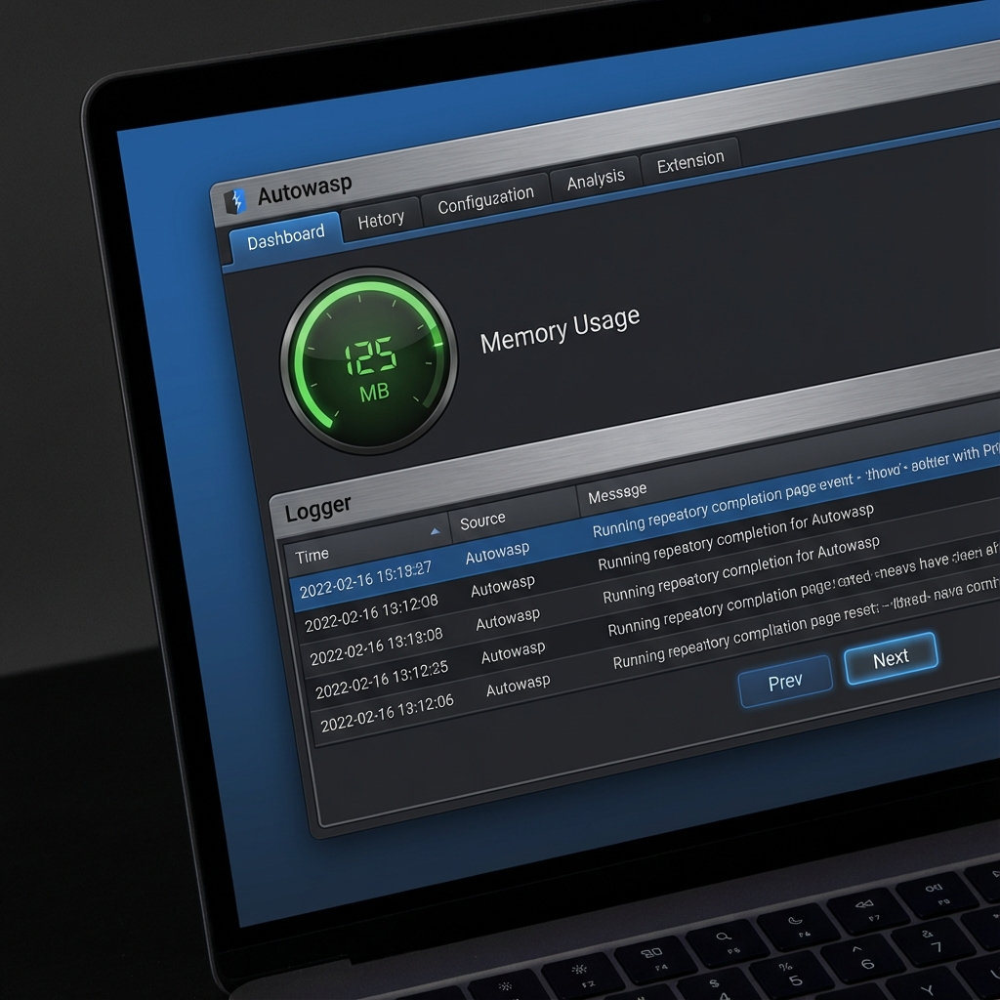

# Autowasp

[](https://opensource.org/licenses/Apache-2.0)

<!-- SonarQube Cloud Badges -->
[](https://sonarcloud.io/summary/new_code?id=brndls_autowasp)
[](https://sonarcloud.io/summary/new_code?id=brndls_autowasp)
[](https://sonarcloud.io/summary/new_code?id=brndls_autowasp)
[](https://sonarcloud.io/summary/new_code?id=brndls_autowasp)


Welcome to Autowasp, a Burp Suite extension that integrates OWASP Web Security Testing Guide (WSTG) directly into your testing workflow. It provides a structured environment for penetration testers to track progress, log traffic, and generate comprehensive reports aligned with industry standards.

## Table of Contents

- [Autowasp](#autowasp)
  - [Table of Contents](#table-of-contents)
  - [Quick Start](#quick-start)
  - [Key Features](#key-features)
    - [1. Testing Checklist - Be guided by OWASP](#1-testing-checklist---be-guided-by-owasp)
    - [2. Logger Tool - Log down the Vulns](#2-logger-tool---log-down-the-vulns)
    - [3. Memory \& Performance - Handle Large Scales](#3-memory--performance---handle-large-scales)
  - [Prerequisites](#prerequisites)
  - [Dependencies](#dependencies)
  - [Installation](#installation)
    - [1. Using Pre-compiled JAR (Recommended)](#1-using-pre-compiled-jar-recommended)
    - [2. Building from Source](#2-building-from-source)
  - [Code Quality \& Testing](#code-quality--testing)
  - [Usage](#usage)
  - [Documentation](#documentation)
  - [Contributing](#contributing)
  - [Authors](#authors)
  - [License](#license)

## Quick Start

1. Download the [latest release](releases)
2. Load extension in Burp Suite (Extensions → Add → Select JAR file)
3. Fetch OWASP WSTG checklist in Autowasp tab
4. Add target URL to scope and enable scanner logging
5. Map findings to checklist and generate reports

📖 **New to Autowasp?** Check out the [User Guide](docs/USER-GUIDE.md) for detailed instructions.

## Key Features

Currently, Autowasp supports the following functionalities:

### 1. Testing Checklist - Be guided by OWASP

With the ability to fetch the OWASP WSTG checklist, Autowasp aims to aid new penetration testers in conducting penetration testing or web application security research. The testing checklist tab will extract useful information such as:

- Summary of OWASP WSTG test cases
- How to test – black/white box testing
- Relevant testing tools to aid your test


### 2. Logger Tool - Log down the Vulns

Autowasp Logger tab gives penetration testers the ability to extract and consolidate Burp Scanner issues. This extender tool will automate and flag vulnerable network traffic issues, allowing users to send vulnerable proxy items from Burp’s `proxy`, `intruder`, and `repeater` tab to the extender. These vulnerable issues can then be mapped to WSTG IDs and be used to generate an Excel report upon engaging in a penetration test.


### 3. Memory & Performance - Handle Large Scales

Autowasp is optimized for performance and stability during long-term engagements. Key improvements include:

- **Pagination:** Smoothly navigate through thousands of log entries without UI lag.
- **Data Limits:** Automatic cleanup and hard limits on list growth to prevent memory exhaustion.
- **Memory Monitor:** Real-time visibility into the extension's memory usage with visual warnings.



## Prerequisites

- Burp Suite Professional or Community (2024.1 or later)
- Java 21 or later

## Dependencies

- **Montoya API 2025.12** (Burp Suite Extension API)
- **Apache Commons Collections 4.5.0-M3**
- **Apache Commons Compress 1.28.0**
- **GSON 2.13.2**
- **Jsoup 1.21.2**
- **Apache POI 5.5.1** (Excel Report Generation)

## Installation

### 1. Using Pre-compiled JAR (Recommended)

1. Download the latest release build [from Releases](releases).
2. Open Burp Suite.
3. Go to **Extensions** tab -> **Installed** -> **Add**.
4. Select **Java** as extension type, click **Select file** and select the `autowasp-2.2.5-jar-with-dependencies.jar` file.

5. You should see no output or errors and a new tab labelled **Autowasp** on the top row.

### 2. Building from Source

For advanced users who want to build the project manually (e.g. using Gradle, Docker, or Nix), please refer to the [Development Guide](docs/DEVELOPMENT.md) for detailed instructions.

## Code Quality & Testing

Autowasp uses **SonarQube Cloud** for continuous code quality analysis and **JaCoCo** for test coverage reporting. This helps maintain high code quality standards and ensures comprehensive test coverage.

[](https://sonarcloud.io/summary/new_code?id=brndls_autowasp)

**Quick commands:**
```bash
./gradlew test              # Run all tests
./gradlew jacocoTestReport  # Generate coverage report
```

📊 For detailed setup and integration instructions, see [SonarQube Guide](docs/SONARQUBE.md).

## Usage

**Typical workflow:**

1. Display OWASP checklist for reference
2. Add target URL to scope
3. Enable Burp Scanner logging or manually explore
4. Map findings to checklist items
5. Add observations and evidence
6. Generate comprehensive reports

📖 **For detailed usage instructions with screenshots, see the [User Guide](docs/USER-GUIDE.md).**

## Documentation

- 📖 [User Guide](docs/USER-GUIDE.md) - Detailed usage instructions
- 🛠️ [Development Guide](docs/DEVELOPMENT.md) - Build and development setup
- 🏗️ [Architecture](docs/ARCHITECTURE.md) - System design and components
- 🗺️ [Roadmap](docs/ROADMAP.md) - Planned features and improvements
- 📊 [SonarQube Setup](docs/SONARQUBE.md) - Code quality integration
- 📝 [Changelog](docs/CHANGELOG.md) - Version history
- 📜 [History](docs/HISTORY.md) - Project background

## Contributing

[](issues)

We welcome contributions! Whether you're fixing bugs, adding features, or improving documentation, your help is appreciated.

**Get started:**
- Read the [Contributing Guide](docs/CONTRIBUTING.md) for coding conventions and guidelines
- Check [open issues](issues) for tasks to work on
- Submit pull requests with clear descriptions

**Questions?** Open an [issue](issues) and we'll help you out.

## Authors

👤 **[@imthomas93](https://github.com/imthomas93)**

👤 **[@retaric](https://github.com/retaric)**

👤 **[@kaiyu92](https://github.com/kaiyu92)**

👤 **[@aloy-wee-sious](https://github.com/aloy-wee-sious)**

👤 **[@matthewng1996](https://github.com/matthewng1996)**

---
## License
This project is licensed under the Apache License 2.0 - see the [LICENSE](LICENSE) file for details.


