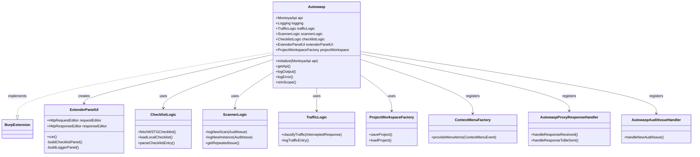

# Autowasp Burp Extension Architecture

This document describes the architecture and design of Autowasp, a Burp Suite extension that integrates issue logging with the OWASP Web Security Testing Guide (WSTG).

## Overview

Autowasp is an extension for Burp Suite Professional that provides:

- **Testing Checklist**: OWASP WSTG guide for penetration testing
- **Logger Tool**: Consolidation and logging of Burp Scanner issues
- **Report Generation**: Generate Excel reports from security findings


---

## Technology Stack

| Component    | Technology              |
| ------------ | ----------------------- |
| API          | Montoya API 2025.12     |
| Language     | Java 21                 |
| Build System | Gradle                  |
| Dependencies | Apache POI, Jsoup, GSON |

---

## Main Class/Package Diagram

The following diagram shows the main class structure and relationships between components:



---

## Data Flow Diagram

This diagram shows how data flows from Burp Suite through the Autowasp extension:


---

## Architecture Components

### 1. Entry Point (Montoya API)

- **Autowasp**: Implements `BurpExtension` interface with `initialize(MontoyaApi api)` method

### 2. Handlers (Montoya API)

| Handler                          | Interface                  | Purpose                              |
| -------------------------------- | -------------------------- | ------------------------------------ |
| **AutowaspProxyResponseHandler** | `ProxyResponseHandler`     | Intercept and classify proxy traffic |
| **AutowaspAuditIssueHandler**    | `AuditIssueHandler`        | Handle scanner audit issues          |
| **ContextMenuFactory**           | `ContextMenuItemsProvider` | Provide right-click menu items       |

### 3. Logic Layer

| Component          | Description                                                     |
| ------------------ | --------------------------------------------------------------- |
| **ChecklistLogic** | Fetch and parse OWASP WSTG checklist from GitHub or local cache |
| **ScannerLogic**   | Manage logging and grouping of audit issues                     |
| **TrafficLogic**   | Classify and log HTTP traffic                                   |

### 4. Data Layer

| Model                   | Description                             |
| ----------------------- | --------------------------------------- |
| **LoggerEntry**         | Representation of discovered issues     |
| **InstanceEntry**       | Specific instance of an issue           |
| **ChecklistEntry**      | Test case from WSTG                     |
| **TrafficEntry**        | HTTP traffic record                     |
| **HTTPRequestResponse** | Wrapper for Montoya HttpRequestResponse |
| **HTTPService**         | Wrapper for Montoya HttpService         |
| **ScanIssue**           | Wrapper for Montoya AuditIssue          |

### 5. UI Layer

| Component              | Description                          |
| ---------------------- | ------------------------------------ |
| **ExtenderPanelUI**    | Main panel displayed in Burp tab     |
| **ChecklistTable**     | Table displaying WSTG checklist      |
| **LoggerTable**        | Table displaying discovered issues   |
| **InstanceTable**      | Table displaying instances per issue |
| **HttpRequestEditor**  | Montoya API request viewer           |
| **HttpResponseEditor** | Montoya API response viewer          |

### 6. Output Layer

- **ProjectWorkspaceFactory**: Save/load project state
- **Excel Report**: Generate reports using Apache POI

---

## Montoya API Integration

### API Migration Summary

| Legacy API               | Montoya API                                |
| ------------------------ | ------------------------------------------ |
| `IBurpExtender`          | `BurpExtension`                            |
| `IBurpExtenderCallbacks` | `MontoyaApi`                               |
| `IProxyListener`         | `ProxyResponseHandler`                     |
| `IScannerListener`       | `AuditIssueHandler`                        |
| `IContextMenuFactory`    | `ContextMenuItemsProvider`                 |
| `IMessageEditor`         | `HttpRequestEditor` / `HttpResponseEditor` |
| `IScanIssue`             | `AuditIssue`                               |
| `IHttpRequestResponse`   | `HttpRequestResponse`                      |

### Registration Pattern

```java
public void initialize(MontoyaApi api) {
    // Register handlers
    api.proxy().registerResponseHandler(new AutowaspProxyResponseHandler(this));
    api.scanner().registerAuditIssueHandler(new AutowaspAuditIssueHandler(this));
    api.userInterface().registerContextMenuItemsProvider(new ContextMenuFactory(this));
    
    // Register tab
    api.userInterface().registerSuiteTab("Autowasp", mainPanel);
    
    // Register unload handler
    api.extension().registerUnloadingHandler(() -> {
        // Cleanup resources
    });
}
```

---

## Dependencies

| Library                    | Version  | Purpose                   |
| -------------------------- | -------- | ------------------------- |
| Montoya API                | 2025.12  | Burp Suite integration    |
| Apache Commons Collections | 4.5.0-M3 | Collection utilities      |
| Apache Commons Compress    | 1.28.0   | Compression support       |
| GSON                       | 2.13.2   | JSON parsing              |
| Jsoup                      | 1.21.2   | HTML parsing (fetch WSTG) |
| Apache POI                 | 5.5.1    | Excel report generation   |
| XMLBeans                   | 5.2.2    | XML support for POI       |

---

## Source Code Structure

```
src/main/java/
├── autowasp/
│   ├── Autowasp.java                    # Core class (BurpExtension)
│   ├── AutowaspProxyResponseHandler.java # Proxy handler
│   ├── AutowaspAuditIssueHandler.java   # Audit issue handler
│   ├── ExtenderPanelUI.java             # Main UI
│   ├── ProjectWorkspaceFactory.java     # Save/load state
│   ├── checklist/
│   │   ├── ChecklistLogic.java          # WSTG handling
│   │   ├── ChecklistTable.java          # Checklist display
│   │   ├── ChecklistTableModel.java
│   │   └── ChecklistEntry.java
│   ├── http/
│   │   ├── ContextMenuFactory.java      # Right-click menu
│   │   ├── HTTPRequestResponse.java     # Request/Response wrapper
│   │   ├── HTTPService.java             # Service wrapper
│   │   └── ScanIssue.java               # AuditIssue wrapper
│   └── logger/
│       ├── ScannerLogic.java            # Scanner issue handling
│       ├── TrafficLogic.java            # Traffic classification
│       ├── TrafficEntry.java
│       ├── entrytable/
│       │   ├── LoggerEntry.java
│       │   ├── LoggerTable.java
│       │   └── LoggerTableModel.java
│       └── instancestable/
│           ├── InstanceEntry.java
│           ├── InstanceTable.java
│           └── InstancesTableModel.java
```

---

## References

- [Montoya API Documentation](https://portswigger.github.io/burp-extensions-montoya-api/javadoc/)
- [Montoya API GitHub](https://github.com/PortSwigger/burp-extensions-montoya-api)
- [OWASP Web Security Testing Guide (WSTG)](https://owasp.org/www-project-web-security-testing-guide/)
- [PortSwigger Extension Development](https://portswigger.net/burp/documentation/desktop/extend-burp/extensions/creating)
