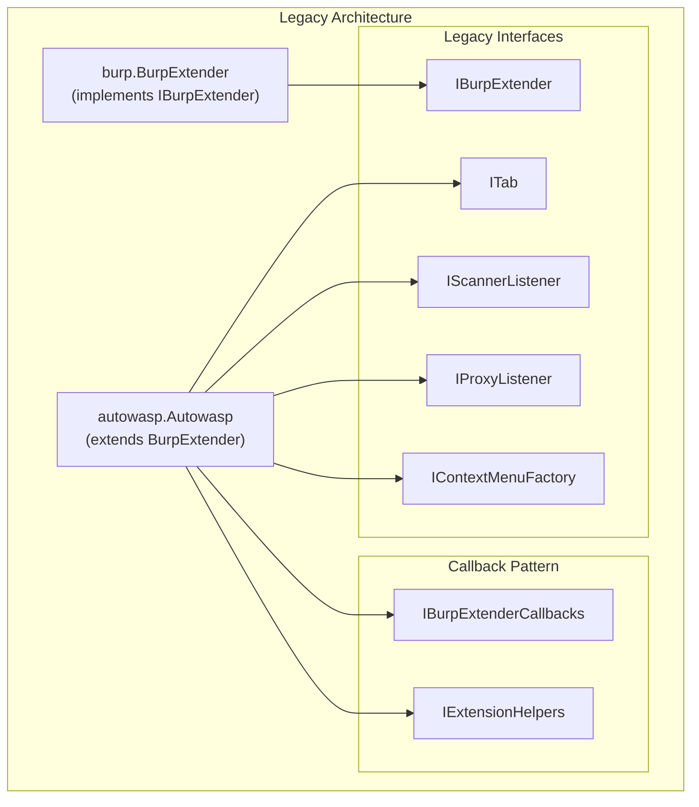
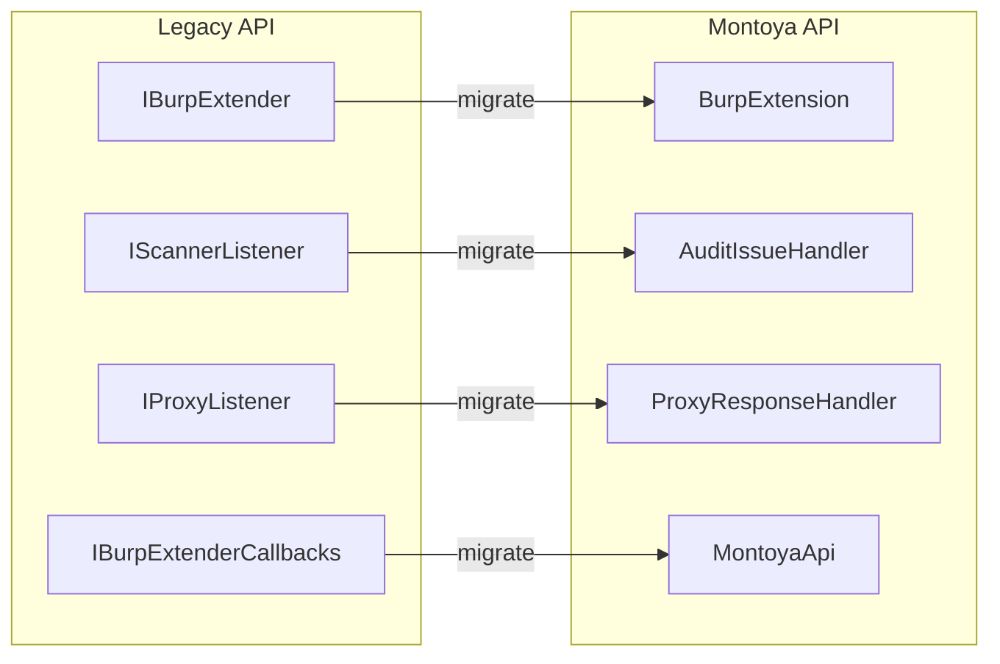
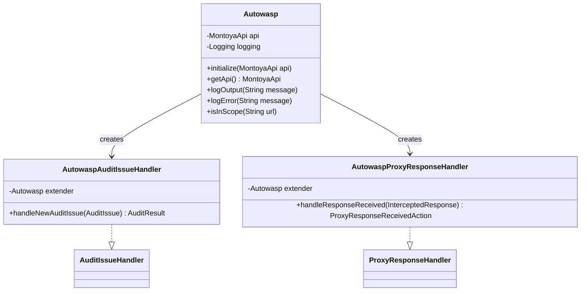
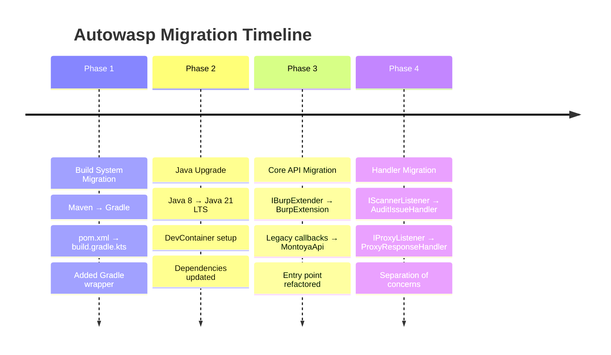

# Autowasp Migration History

This document chronicles the migration journey of Autowasp from its original legacy implementation to the modern Montoya API architecture.

---

## Original Features (Pre-Migration)

### Overview

Autowasp was originally developed by Government Technology Agency (GovTech) Singapore as a Burp Suite extension that integrates issue logging with OWASP Web Security Testing Guide (WSTG).

### Core Features

| Feature               | Description                                                                                 |
| --------------------- | ------------------------------------------------------------------------------------------- |
| **Testing Checklist** | Fetch and display OWASP WSTG checklist with test case summaries, testing methods, and tools |
| **Logger Tool**       | Extract and consolidate Burp Scanner issues with traffic classification                     |
| **Report Generation** | Generate Excel reports with findings mapped to WSTG categories                              |
| **Context Menu**      | Send requests from Proxy/Intruder/Repeater to Autowasp for analysis                         |
| **Project Workspace** | Save and load project state for continued testing                                           |

### Original Technology Stack

| Component    | Version                    | Notes                                             |
| ------------ | -------------------------- | ------------------------------------------------- |
| Java         | 1.8 (Java 8)               | Minimum required version                          |
| Build System | Maven                      | Using `pom.xml` configuration                     |
| Burp API     | Legacy Extender API 1.7.13 | `net.portswigger.burp.extender:burp-extender-api` |
| Apache POI   | 4.1.0                      | Excel report generation                           |
| Jsoup        | 1.12.1                     | HTML parsing for WSTG fetch                       |
| GSON         | 2.8.5                      | JSON parsing                                      |

### Original Architecture



### Legacy Entry Point

```java
// Original entry point - burp.BurpExtender.java
package burp;

public class BurpExtender extends Autowasp implements IBurpExtender {
    @Override
    public void registerExtenderCallbacks(IBurpExtenderCallbacks callbacks) {
        // Initialize extension via callbacks
        this.callbacks = callbacks;
        this.helpers = callbacks.getHelpers();
        // ...
    }
}
```

---

## Migration Goals

### Primary Objectives

1. **Modernize Codebase**: Upgrade from Java 8 to Java 21 LTS
2. **Adopt Modern Build System**: Migrate from Maven to Gradle with Kotlin DSL
3. **Future-Proof API**: Migrate from deprecated Legacy Extender API to Montoya API
4. **Improve Development Experience**: Add DevContainer support for consistent development environment

### Rationale

| Aspect               | Legacy            | Montoya                | Benefit                     |
| -------------------- | ----------------- | ---------------------- | --------------------------- |
| **API Status**       | Deprecated        | Actively maintained    | Long-term support           |
| **Type Safety**      | Weak typing       | Strong typing          | Fewer runtime errors        |
| **Interface Design** | Complex callbacks | Clean single interface | Easier to maintain          |
| **Java Features**    | Java 8            | Java 17+               | Modern language features    |
| **Documentation**    | Limited           | Comprehensive          | Better developer experience |

### Non-Goals

- Supporting legacy Burp Suite versions (pre-2023)
- Maintaining backward compatibility with Legacy API
- Changing core business logic during migration

---

## Migration Phases

### Phase 1: Build System Migration (Maven → Gradle)

**Status**: ✅ Completed

**Objectives**:

- Migrate from Maven `pom.xml` to Gradle `build.gradle.kts`
- Adopt Kotlin DSL for better IDE support
- Configure Shadow plugin for fat JAR generation

**Changes Made**:

| File                     | Action                         | Description                            |
| ------------------------ | ------------------------------ | -------------------------------------- |
| `pom.xml`                | Backed up to `.legacy-backup/` | Original Maven configuration preserved |
| `build.gradle.kts`       | Created                        | New Gradle build configuration         |
| `settings.gradle.kts`    | Created                        | Gradle project settings                |
| `gradle/wrapper/*`       | Added                          | Gradle wrapper for consistent builds   |
| `gradlew`, `gradlew.bat` | Added                          | Build scripts for Unix/Windows         |

**Dependency Upgrades**:

| Dependency                 | Legacy Version | New Version |
| -------------------------- | -------------- | ----------- |
| Apache Commons Collections | 4.4            | 4.5.0-M3    |
| Apache Commons Compress    | 1.19           | 1.28.0      |
| GSON                       | 2.8.5          | 2.13.2      |
| Jsoup                      | 1.12.1         | 1.21.2      |
| Apache POI                 | 4.1.0          | 5.5.1       |

---

### Phase 2: Java Version Upgrade (Java 8 → Java 21)

**Status**: ✅ Completed

**Objectives**:

- Upgrade Java source/target compatibility to Java 21
- Set up DevContainer with Java 21 environment

**Changes Made**:

| File                              | Change                                         |
| --------------------------------- | ---------------------------------------------- |
| `build.gradle.kts`                | `sourceCompatibility = JavaVersion.VERSION_21` |
| `.devcontainer/Dockerfile`        | `FROM eclipse-temurin:21-jdk`                  |
| `.devcontainer/devcontainer.json` | Java 21 configuration                          |

**New Java Features Available**:

| Feature                        | Description                   |
| ------------------------------ | ----------------------------- |
| Virtual Threads (Project Loom) | Lightweight concurrency       |
| Pattern Matching for switch    | Enhanced switch expressions   |
| Record Patterns                | Destructuring for records     |
| Sequenced Collections          | Ordered collection operations |
| String Templates (Preview)     | String interpolation          |

---

### Phase 3: Montoya API Migration (Core Extension)

**Status**: ✅ Completed

**Objectives**:

- Migrate entry point from `IBurpExtender` to `BurpExtension`
- Replace `registerExtenderCallbacks()` with `initialize(MontoyaApi)`
- Migrate proxy handling from `IProxyListener` to `ProxyResponseHandler`
- Migrate scanner handling from `IScannerListener` to `AuditIssueHandler`

**Architecture Changes**:



**Files Modified**:

| File                                | Before                                                             | After                                 |
| ----------------------------------- | ------------------------------------------------------------------ | ------------------------------------- |
| `Autowasp.java`                     | `implements IBurpExtender, ITab, IScannerListener, IProxyListener` | `implements BurpExtension`            |
| `AutowaspAuditIssueHandler.java`    | N/A (new file)                                                     | `implements AuditIssueHandler`        |
| `AutowaspProxyResponseHandler.java` | N/A (new file)                                                     | `implements ProxyResponseHandler`     |
| `burp/BurpExtender.java`            | Entry point class                                                  | Removed (entry point now in Autowasp) |

**API Mapping**:

| Legacy API                                            | Montoya API                                              |
| ----------------------------------------------------- | -------------------------------------------------------- |
| `IBurpExtenderCallbacks.setExtensionName()`           | `api.extension().setName()`                              |
| `IBurpExtenderCallbacks.registerSuiteTab()`           | `api.userInterface().registerSuiteTab()`                 |
| `IBurpExtenderCallbacks.registerContextMenuFactory()` | `api.userInterface().registerContextMenuItemsProvider()` |
| `IBurpExtenderCallbacks.registerProxyListener()`      | `api.proxy().registerResponseHandler()`                  |
| `IBurpExtenderCallbacks.registerScannerListener()`    | `api.scanner().registerAuditIssueHandler()`              |
| `callbacks.printOutput()`                             | `api.logging().logToOutput()`                            |
| `callbacks.printError()`                              | `api.logging().logToError()`                             |
| `callbacks.isInScope(URL)`                            | `api.scope().isInScope(url)`                             |
| `callbacks.issueAlert()`                              | `api.logging().raiseInfoEvent()`                         |

**Code Migration Example**:

```diff
- public class BurpExtender extends Autowasp implements IBurpExtender {
-     @Override
-     public void registerExtenderCallbacks(IBurpExtenderCallbacks callbacks) {
-         this.callbacks = callbacks;
-         this.helpers = callbacks.getHelpers();
-         callbacks.setExtensionName("Autowasp");
-     }
- }

+ public class Autowasp implements BurpExtension {
+     private MontoyaApi api;
+     
+     @Override
+     public void initialize(MontoyaApi api) {
+         this.api = api;
+         api.extension().setName("Autowasp");
+     }
+ }
```

---

### Phase 4: Handler Migration (Listeners → Handlers)

**Status**: ✅ Completed

**Objectives**:

- Create dedicated handler classes for better separation of concerns
- Implement proper error handling with Montoya API patterns

**New Handler Architecture**:



**Handler Implementations**:

| Handler                        | Interface              | Purpose                                          |
| ------------------------------ | ---------------------- | ------------------------------------------------ |
| `AutowaspAuditIssueHandler`    | `AuditIssueHandler`    | Process scanner findings and log to Logger table |
| `AutowaspProxyResponseHandler` | `ProxyResponseHandler` | Monitor proxy traffic for scope-aware logging    |

---

## Migration Summary



---

## Legacy Backup Reference

Original files are preserved in `.legacy-backup/` directory:

```
.legacy-backup/
├── pom.xml                # Original Maven configuration
└── phase3-montoya/
    ├── autowasp/          # Pre-migration autowasp package
    └── burp/              # Legacy BurpExtender entry point
```

---

## References

- [Montoya API Documentation](https://portswigger.github.io/burp-extensions-montoya-api/javadoc/)
- [Montoya API Examples](https://github.com/PortSwigger/burp-extensions-montoya-api-examples)
- [OWASP Web Security Testing Guide](https://owasp.org/www-project-web-security-testing-guide/)
- [Original Autowasp Repository](https://github.com/govtech-csg/Autowasp)
